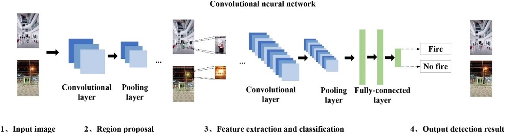
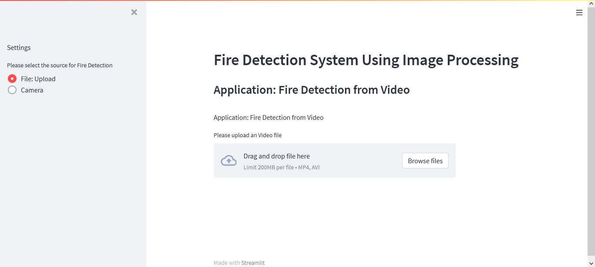
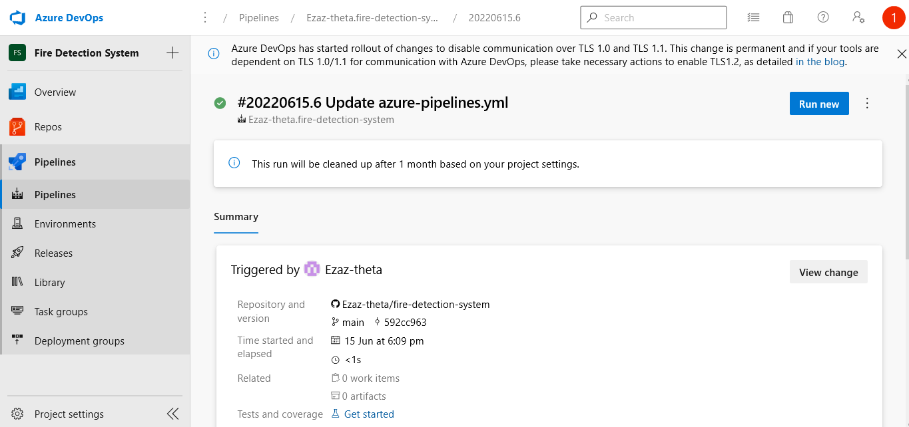

# Fire-Detection-System
Fire Detection System using Image processing

The aim of the project is to early detection of fire apart from preventive measures to reduce the losses due to hazardous fire.

In this project, we have developed a method to detect fires in different scenarios using image processing. To begin with, based on the static and dynamic characteristics of fire, a large number of non-fire images in the video stream are filtered. 

In the process, for the fire images in the video stream, the suspected fire area in the image is extracted. Eliminate the influence of light sources, candles and other interference sources to reduce the interference of complex environments on fire detection. Then, the algorithm encodes the extracted region and inputs it into convolution network, which extracts the depth feature of the image and finally judges whether there is a fire in the image.

 

 

<b>GUI:</b>
Developed using Streamlit
 
 

 

<b>Deployment:</b>
Deployed using Azure App Service

App is deployed on azure app service and is using pipeline for updating to latest push available on GitHub.
 
 

 
Link to Deployed Application:  
  <b><a href="https://fire-system.azurewebsites.net/" >https://fire-system.azurewebsites.net/</a></b> 
   

The pretrained <b>YOLOv3</b> model is available for download via the link below.    
  <b><a href="https://github.com/OlafenwaMoses/FireNET/releases/download/v1.0/detection_model-ex-33--loss-4.97.h5" >https://github.com/OlafenwaMoses/FireNET/releases/download/v1.0/detection_model-ex-33--loss-4.97.h5</a></b> 
   

 

<h3><b><u>References</u></b></h3>

 1. Joseph Redmon and Ali Farhadi, YOLOv3: An Incremental Improvement  
 <a href="https://arxiv.org/abs/1804.02767" >https://arxiv.org/abs/1804.02767</a>  
 
 2. Moses, and John Olafenwa. (2018–). ImageAI, an open source python library built to empower developers to build applications and systems with selfcontained Computer Vision capabilities  
 <a href="https://github.com/OlafenwaMoses/ImageAI" >https://github.com/OlafenwaMoses/ImageAI</a>    
 
